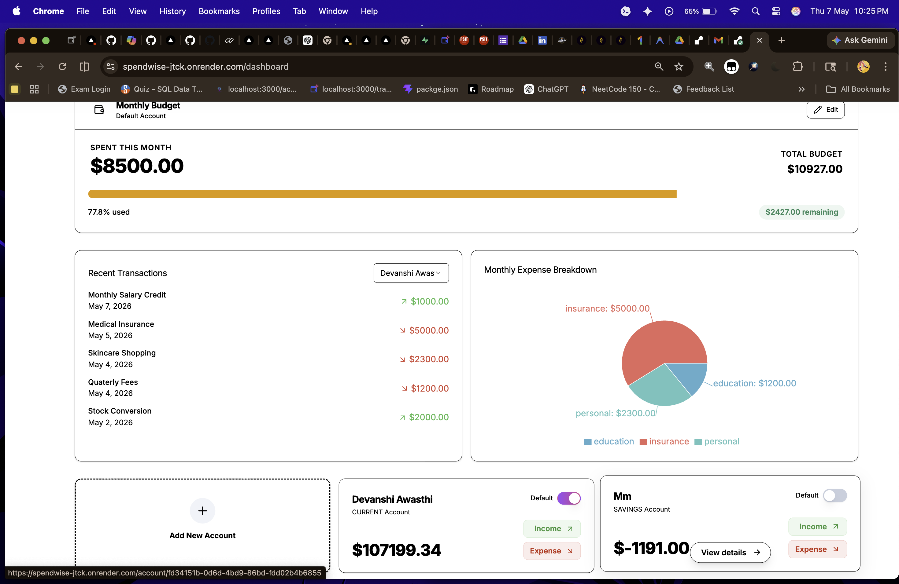
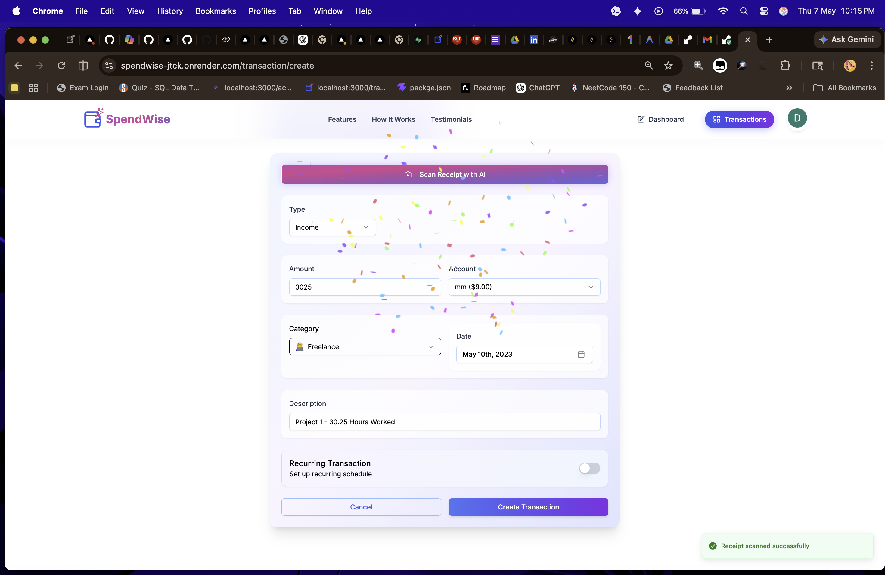
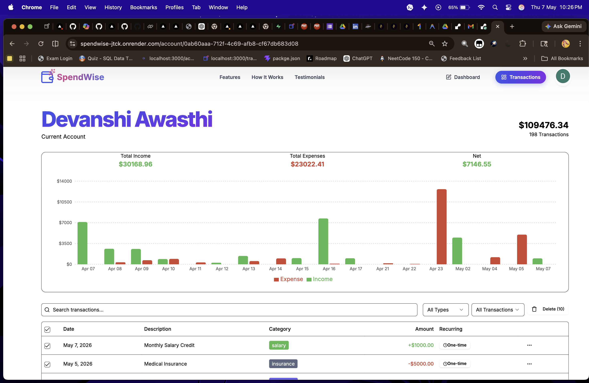

# 🌐 [SpendWise – Live Demo](https://spendwise-jtck.onrender.com/)

**Spend intelligently, save effortlessly.**  
SpendWise is a full‑stack FinTech application that automates expense tracking, receipt scanning, and financial insights — designed for clarity, speed, and impact.

---

## 🚀 Features
- **[OCR Receipt Scanning](ca://s?q=Explain_OCR_receipt_scanning)** – Upload receipts, auto‑extract text with Tesseract.js.  
- **[Secure Authentication](ca://s?q=Explain_JWT_authentication)** – JWT + bcrypt for privacy.  
- **[Interactive Dashboards](ca://s?q=Explain_ChartJS_dashboards)** – Visualize spending trends with Chart.js.  
- **[Mobile‑First PWA](ca://s?q=Explain_PWA_features)** – Offline support, responsive UI.  
- **[Financial Insights](ca://s?q=Explain_AI_financial_insights)** – AI‑powered monthly reports with actionable tips.  

---

## 📸 Screenshots

### Dashboard Overview




### Receipt OCR in Action



### Expense Visualization


### Mobile PWA Interface


### Monthly Insights


---

## 🛠️ Tech Stack
- **Frontend**: Next.js, React, Framer Motion  
- **Backend**: Node.js, Prisma, Supabase (Postgres)  
- **Auth**: Clerk, JWT, bcrypt  
- **AI Integration**: Gemini API for insights  
- **Deployment**: Vercel / Render  

---

## 📈 Meaningful Insights
SpendWise isn’t just about logging expenses — it’s about **financial awareness**:
- Identifies overspending categories (e.g., food vs. entertainment).  
- Predicts monthly spending vs. actuals.  
- Generates **3 actionable insights** per report (e.g., “Cut recurring subscriptions to save 12%”).  
- Encourages **habit change** with visual cues and reminders.  

---

## ⚙️ Installation
```bash
git clone https://github.com/DevanshiA29/SpendWise.git
cd SpendWise
npm install
npm run dev
